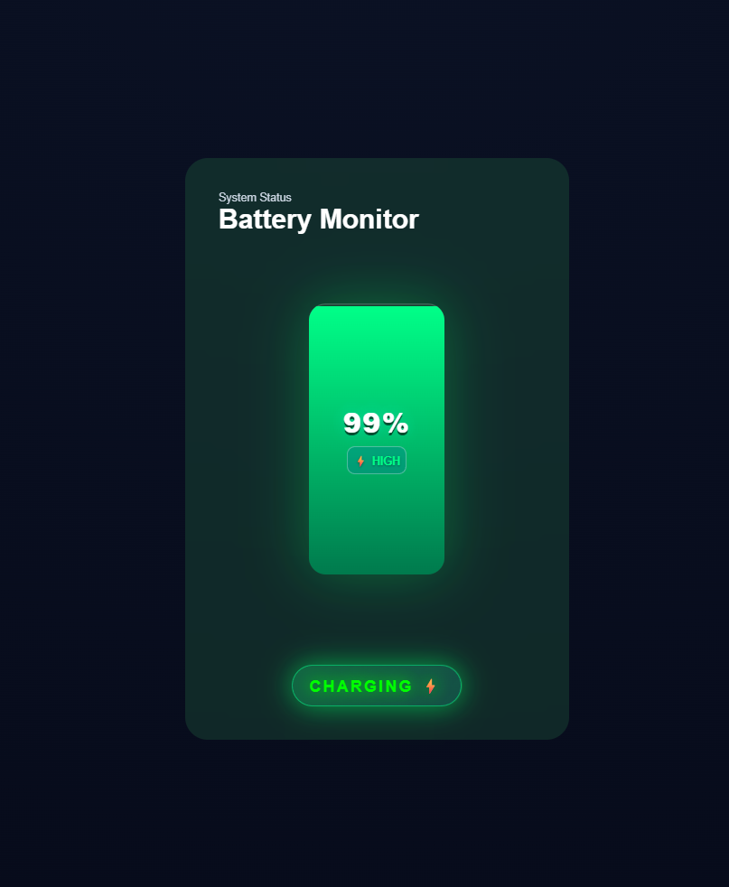

# 🔋 Battery Status Monitor

A Battery Status Monitor built with **HTML**, **CSS**, and **Pure JavaScript**.

This project uses the **Battery Status API** to display your device's battery percentage, charging status, and visual battery health indicators in real-time.

---

## ✨ Features

- 🔋 Real-time battery percentage tracking
- ⚡ Detects charging state automatically
- 🎨 Dynamic color changes based on battery level
- 🚀 Built with Pure JavaScript (No Frameworks)

---

## 📸 Preview



---

## 🛠️ Technologies Used

- HTML5
- CSS3
- JavaScript (ES6+)
- Battery Status API

---

## 📂 Project Structure

```bash
BatteryStatus/
│
├── index.html
├── style/
│   └── style.css
│
├── script/
│   └── app.js
│
└── preview.png
```

---

## ⚙️ How It Works

The application accesses the browser's Battery API:

```javascript
const battery = await navigator.getBattery();
```

It continuously listens for:

- Battery level changes
- Charging status changes

and updates the UI instantly.

## 🚀 Getting Started

### Clone Repository

```bash
git clone https://github.com/Mamadinit1/batteryStatus.git
```

### Open Project

Simply open:

```bash
index.html
```

inside your browser.

---

## ⚠️ Browser Support

The Battery Status API is not supported in all browsers.

Works best in browsers that still implement:

```javascript
navigator.getBattery();
```

---

## 🤝 Contributions

Contributions, issues, and feature requests are welcome.

If you have ideas to improve the project:

- Fork the repository
- Create a feature branch
- Commit your changes
- Open a Pull Request

---

### Thank You 💙 For Visiting This Project
